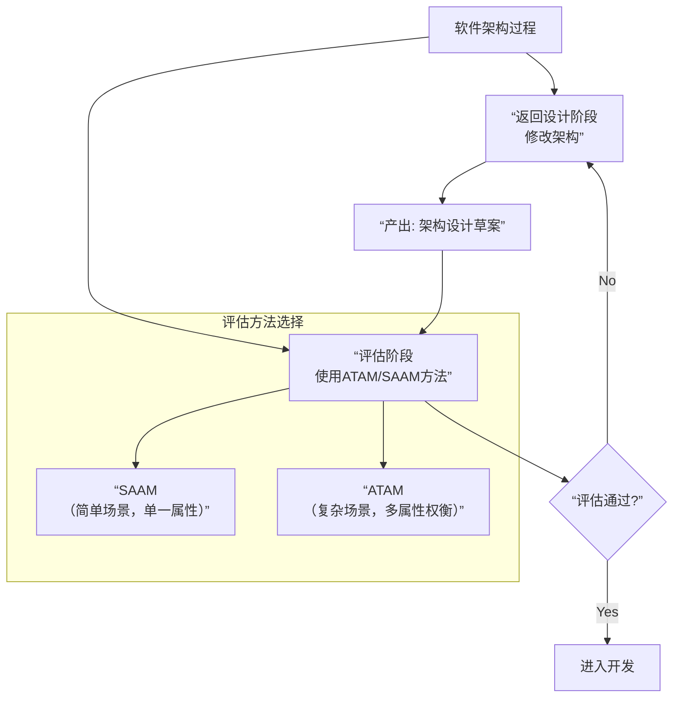

---
tags:
  - 题型/选择题-完形填空
  - 知识域/软件架构设计方法
  - 方法/ABSD
  - 状态/待复习
---

## 原题与答案
> 某公司采用基于架构的软件设计方法进行软件设计与开发。ABSD方法有三个基础，分别是对系统进行功能分解、采用（ ）实现质量属性与商业需求、采用软件模板设计软件结构。
> ABSD方法主要包括架构需求等6个主要活动，其中（ ）活动的目标是标识潜在的风险，及早发现架构设计中的缺陷和错误；（ ）活动针对用户的需求变化，修改应用架构，满足新的需求。
> 小王是该公司的一位新任架构师，在某项目中主要负责架构文档化方面的工作。小王（ ）的做法不符合架构文档化的原则。架构文档化的主要输出结果是架构规格说明书和（ ）。

- **正确答案**：
    1.  **A. 架构风格**
    2.  **架构复审**
    3.  **架构演化**
    4.  **文档只保存在个人电脑，不进行分发**（或类似描述）
    5.  **架构质量说明书**

## 深度解析

### 核心考点
本题系统考察 **“ABSD方法的三大基础、六大活动及架构文档化原则”**。

### 逐空分析（针对第一空）
- **A（架构风格）为什么正确**：
    - 在ABSD中，**架构风格**是预先定义好的、可复用的架构模式。选择恰当的架构风格（如分层、微服务）是实现性能、安全性、可修改性等**质量属性**最根本的途径，从而满足**商业需求**。

- **B/C/D为什么错误**：
    - **B. 设计模式**：层次太低，解决代码级问题，无法直接实现系统级质量属性。
    - **C. 架构策略**：非标准术语，不如“架构风格”准确。
    - **D. 架构描述**：是设计结果的记录，而非实现手段。

### 知识总结：ABSD框架速查

**三大基础：**
1.  功能分解
2.  **架构风格**（实现质量属性）
3.  软件模板

**六大活动：**
1.  架构需求
2.  架构设计
3.  **架构文档化**
4.  **架构复审**（识别风险）
5.  架构实现
6.  **架构演化**（适应需求变化）

**架构文档化原则：**
- 从使用者角度编写
- **必须分发给所有开发人员**
- 保持最新
- 全面详细

**主要输出：**
- 架构规格说明书
- **架构质量说明书**

## 巩固自测
> **Q1**: 确保架构模型被团队正确理解的活动是？
> **A. 需求 B. 设计 C. 文档化 D. 复审**
> **答案：C**

> **Q2**: 关于架构文档化，正确的是？
> **A. 末期编写 B. 只分发给核心人员 C. 从编写者视角 D. 输出规格和质量说明书**
> **答案：D**

---
*本笔记创建于 {{date}}， 关联知识点：[[软件架构风格]]*

关于absd和attm saam区别
非常好的问题！ABSD、ATAM和SAAM是软件架构领域中三个核心但目的完全不同的概念。简单来说：

- **ABSD 是一种“设计方法”**——告诉你**如何从零开始构建**一个架构。
- **ATAM/SAAM 是一种“评估方法”**——告诉你**如何评审和检验**一个已经存在的（或草案）架构。

下面我们用一张图和一个表格来彻底讲清楚它们的区别。

### 🎯 核心关系一图看懂

### 📊 三种方法详细对比

| 维度 | **ABSD** (基于架构的软件设计) | **SAAM** (基于场景的架构分析方法) | **ATAM** (架构权衡分析方法) |
| :--- | :--- | :--- | :--- |
| **核心目标** | **指导如何设计**出一个好架构 | **评估**架构的**可修改性** | **评估**多个质量属性的**权衡** |
| **阶段** | **设计/构建阶段** | **评估/评审阶段** | **评估/评审阶段** |
| **输出物** | **架构本身**（设计文档） | **评估报告**（风险点、场景交互） | **评估报告**（权衡点、敏感点、风险点） |
| **关注点** | 如何分解功能、如何选择架构风格来实现质量属性 | 架构对特定变更场景的支持程度 | 架构决策对不同质量属性（如性能vs安全）的影响与取舍 |
| **复杂性** | 一套完整的设计方法论 | 相对简单，易于上手 | 相对复杂，需要更多干系人参与 |
| **关系** | **“厨师做菜”** | **“美食家品鉴一道菜”** | **“美食家品鉴一桌宴席的搭配”** |

---

### 💡 举个例子来理解

假设你要**开发一个大型电商平台**：

1.  **首先，你用ABSD来设计架构：**
    - 你进行**功能分解**（用户管理、商品管理、订单管理、支付）。
    - 你选择**微服务架构风格**来实现**可扩展性**和**可独立部署**的质量属性。
    - 你完成了架构设计图。**（ABSD的工作结束）**

2.  **然后，你用ATAM来评估这个架构设计：**
    - 你召集项目经理、开发、测试、运维等干系人。
    - 大家提出场景：“双十一流量暴涨100倍”（性能场景）、“支付系统需要升级加密算法而不影响下单”（可修改性场景）。
    - 通过分析，你发现：为了应对高并发而引入的缓存，导致了商品数据**实时性下降**（这是一个**权衡点**）。
    - ATAM评估会帮你识别出这个设计中的矛盾和风险。**（ATAM的工作结束）**

3.  **（如果只是一个简单的系统）你可能用SAAM来评估：**
    - 你只关心“未来更换数据库是否困难”。
    - 提出一系列变更场景，分析哪些组件会受影响，评估其可修改性。

---

### ✅ 总结与记忆口诀

- **ABSD：干活的方法**。是**设计师**的工具。
- **SAAM/ATAM：挑刺的方法**。是**评审官**的工具。
  - **SAAM**：看**一个方面**（主要是可修改性）行不行。
  - **ATAM**：看**多个方面**（性能、安全、可用性...）之间能不能兼顾。

**一句话厘清关系：**
你先用 **ABSD** 把架构设计出来，然后再用 **ATAM** 或 **SAAM** 来检查这个设计好不好，有没有潜在的风险和矛盾。它们是在软件生命周期不同阶段使用的、相辅相成的工具。