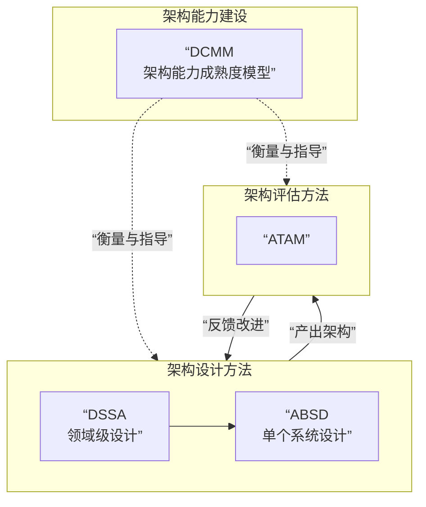

---
tags:
  - 题型/选择题
  - 知识域/软件架构设计与复用
  - 方法/DSSA
  - 状态/待复习
  - DSSA
---

## 原题
> DSSA（特定领域软件架构）就是专用于一类特定类型的任务(领域)的、在整个领域中能有效地使用的、为成功构造应用系统限定了标准的组合结构的软件构件的集合。有三个基本的过程包括：领域分析、（ ）、领域实现。
> **选项**:
> A. 领域调查
> B. 领域设计
> C. 领域建模
> D. 领域流程处理

- **我的答案**：[此处可填写你的原始选择]
- **正确答案**：B

## 深度解析

### 核心考点
本题考察 **“DSSA方法中三个核心过程的名称与顺序的准确记忆”**。

### 逐项分析
- **B（领域设计）为什么正确**：
    - DSSA的三个标准过程是：**领域分析 -> 领域设计 -> 领域实现**。
    - **领域设计** 是承上启下的关键阶段，它基于领域分析的成果（领域模型），**设计出通用的特定领域软件架构**。

- **A/C/D为什么错误**：
    - **A. 领域调查**：是领域分析阶段的一种信息收集手段，不能作为一个独立的、与分析和实现并列的核心过程。
    - **C. 领域建模**：这是**领域分析阶段的主要产出和活动**。将它作为一个独立阶段会造成逻辑混乱。
    - **D. 领域流程处理**：非标准术语，含义模糊。

### 知识总结：DSSA框架速查

**DSSA（特定领域软件架构）**
- **目标**：在特定领域内实现系统化的软件复用。
- **核心**：一个通用的、可供领域中所有系统复用的软件架构。

**三个基本过程：**
1.  **领域分析**
    - **任务**：建立**领域模型**。
    - **焦点**：领域**做什么**？（需求、功能）

2.  **领域设计**
    - **任务**：获得**DSSA**。
    - **焦点**：领域**怎么做**？（架构设计）

3.  **领域实现**
    - **任务**：开发**可复用资源**（构件、框架）。
    - **焦点**：**构建**领域内的应用系统。

**关键记忆点：**
- DSSA过程 = **分析 -> 设计 -> 实现**。
- **领域设计** 是连接需求（分析）和构建（实现）的桥梁。

## 巩固自测
> **Q1**: 识别共性需求、形成领域模型，是哪个阶段？
> **A. 设计 B. 分析 C. 实现 D. 建模**
> **答案：B**

> **Q2**: 关于DSSA实现阶段，正确的是？
> **A. 设计通用架构 B. 市场调研 C. 开发可复用构件 D. 建立领域边界**
> **答案：C**

---
*本笔记创建于 {{date}}， 关联知识点：[[软件产品线]]*

# dssa 和 absd atam dcmm有关系吗 有什么区别

非常好的问题！这四个缩写确实是软考架构师中容易混淆的核心概念。它们分别位于软件架构生命周期的不同阶段，扮演着不同的角色。

**核心结论：**
- **ABSD** 和 **DSSA** 是**设计方法**，告诉你**如何构建**架构。
- **ATAM** 是**评估方法**，告诉你**如何评审**架构。
- **DCMM** 是**成熟度模型**，告诉你**如何衡量和改进**你的架构能力。

下面我们用一张图来清晰地展示它们的关系，然后再详细对比。

### 🎯 核心关系一图看懂

### 📊 四种方法详细对比

| 维度 | **DSSA** 特定领域软件架构 | **ABSD** 基于架构的软件设计 | **ATAM** 架构权衡分析方法 | **DCMM** 软件架构能力成熟度模型 |
| :--- | :--- | :--- | :--- | :--- |
| **它是什么？** | 一种**领域级**的、**战略性的**复用和设计方法。 | 一种**单个系统**的架构**设计方法**。 | 一种架构**质量评估与风险识别**方法。 | 一个**评估和改进**组织架构实践能力的**标准框架**。 |
| **核心目标** | 在**一个领域内**（如电商、金融）实现系统化复用，**设计通用架构**。 | **指导如何为一个具体系统**设计出满足需求的架构。 | **评估**一个架构设计是否满足**多个质量属性**，识别**权衡点**和**风险**。 | **评估组织**的架构实践水平，并**提供改进路径**。 |
| **关注范围** | **宽**（整个业务领域） | **窄**（单个具体系统） | **可宽可窄**（一个待评估的架构） | **最宽**（整个组织的能力） |
| **在生命周期中的阶段** | **设计前** + **设计** （为领域规划蓝图） | **设计** （为系统画设计图） | **设计后**（评审） （评审设计图的好坏） | **全程** （衡量整个组织的设计/评审能力） |
| **输出物** | **领域模型**、**通用领域架构**、**可复用构件库** | **单个系统的架构设计文档** | **评估报告**（风险点、权衡点、敏感点） | **成熟度等级评分**、**改进建议** |
| **通俗比喻** | **“城市规划局”** 制定整个区域的建筑规范和标准图纸。 | **“建筑设计师”** 根据规范和客户需求，设计一栋具体的楼房。 | **“建筑监理”** 检查设计图纸和建筑结构是否安全、合理。 | **“住建部评级标准”** 评估一个建筑公司的综合设计和施工能力等级。 |

---

### 💡 它们之间如何协作？

在实际项目中，这些方法可以协同工作：

1.  **理想流程**：
    - 一个组织首先用 **DCMM** 了解自身架构能力处于什么水平。
    - 在开发一个**产品线**时（如一系列电商系统），采用 **DSSA** 方法，设计出整个电商领域的通用架构。
    - 当需要开发**其中一个具体的电商系统**时，架构师基于DSSA产出的通用架构，运用 **ABSD** 方法进行具体的设计。
    - 在设计完成后，邀请专家团队使用 **ATAM** 方法对架构设计进行评估，发现潜在问题。
    - 根据ATAM的反馈修改设计，并持续用DCMM模型提升组织整体的架构能力。

2.  **关键区别**：
    - **DSSA 与 ABSD**：是**层次**不同。DSSA是“领域工程”，关注复用；ABSD是“应用工程”，关注单个系统的实现。DSSA的输出可以作为ABSD的输入。
    - **ABSD 与 ATAM**：是**阶段**不同。ABSD是“做设计”，ATAM是“评设计”。一个在“写答案”，一个在“批改答案”。
    - **DCMM 与 其他三者**：是**维度**不同。DCMM不关心具体的设计或评估技术，它关心组织有没有能力、有没有流程去很好地执行这些技术。

---

### ✅ 总结与记忆口诀

- **DSSA**：管**一片**（领域），为**复用**。
- **ABSD**：管**一个**（系统），教**设计**。
- **ATAM**：管**评审**，找**风险**。
- **DCMM**：管**组织**，评**能力**。

希望这个从定位、目标到协作关系的全面梳理，能帮你彻底厘清这四个核心概念！