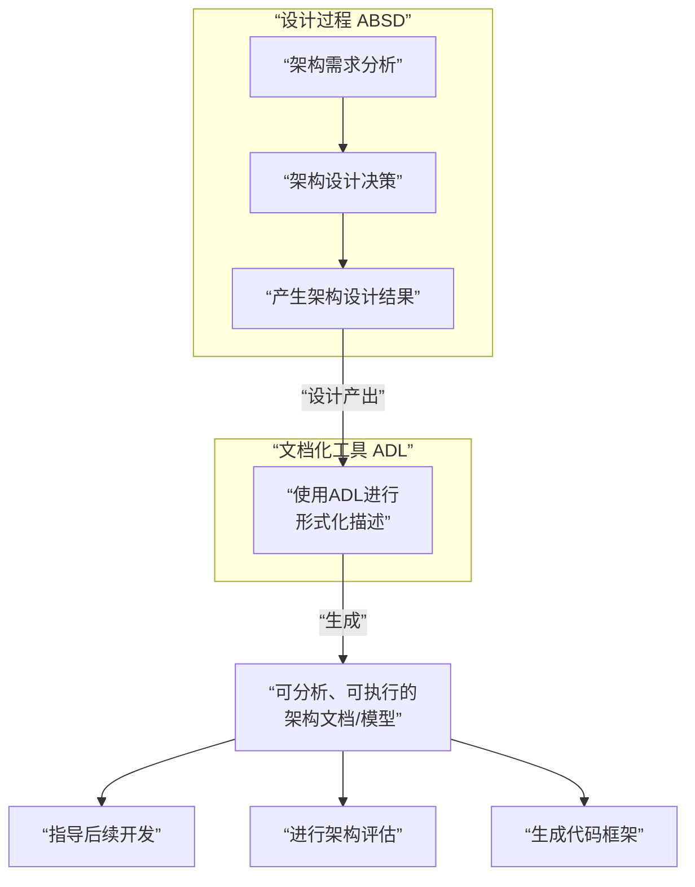

---
tags:
  - 错题/软考架构师
  - 题型/选择题
  - 知识域/软件架构设计
  - 概念/ADL
  - 状态/待复习
---

## 原题
> 体系架构描述语言（ADL）的主要特点是 （ ） 。
> **选项**:
> A. 专注于系统的用户界面设计
> B. 详细描述构件间的互联机制
> C. 专注于软件的编码标准
> D. 评估软件的质量属性

- **我的答案**：[此处可填写你的原始选择]
- **正确答案**：B

## 深度解析

### 核心考点
本题考察 **“对体系结构描述语言根本目的的准确理解”**。

### 逐项分析
- **B（详细描述构件间的互联机制）为什么正确**：
    - ADL的诞生就是为了**形式化地、精确地描述软件架构**。
    - 架构的核心就是**构件**、**连接件**以及它们之间的**配置**（即互联关系）。因此，详细描述构件间如何通过连接件进行交互，是ADL最本质的特点。

- **A（专注于系统的用户界面设计）为什么错误**：
    - 用户界面设计属于具体的实现细节和交互设计，是架构确定之后的工作。ADL关注的是**高层次、与技术无关的系统逻辑结构**。

- **C（专注于软件的编码标准）为什么错误**：
    - 编码标准是编程阶段的规范，与描述系统宏观蓝图的ADL完全不在一个抽象层次上。

- **D（评估软件的质量属性）为什么错误**：
    - 这是一个常见的混淆点。ADL提供了**评估的基础**（即架构描述），但**评估这个动作本身**是由ATAM、SAAM等专门的**架构评估方法**来完成的。ADL本身不进行评估。

### 知识总结：ADL精要

**ADL是什么？**
- 一种**形式化语言**，用于**精确、无歧义**地描述软件架构。

**ADL描述什么？（核心三要素）**
1.  **构件**：系统的计算单元或数据存储。
2.  **连接件**：构件间的交互规则与协议。
3.  **配置**：构件和连接件之间的**互联拓扑**。

**ADL的主要能力：**
- **建模与可视化**：创建架构模型。
- **分析**：支持对架构的静态分析和早期验证。
- **代码生成**：部分ADL支持从模型生成系统框架代码。

**关键记忆点：**
- ADL = 架构的**“工程蓝图语言”**。
- 核心特点：**详细描述构件、连接件及其互联机制**。

## 巩固自测
> **Q1**: 用ADL写规格说明，最不可能包含？
> **A. 构件接口 B. 连接件协议 C. 构件内部算法 D. 拓扑结构**
> **答案：C**
> **解析**：ADL不关心构件内部实现。

> **Q2**: 关于ADL和UML，最准确的是？
> **A. UML可替代ADL B. ADL管动态，UML管静态 C. ADL描述架构更精确 D. ADL是面向对象的**
> **答案：C**
> **解析**：ADL是专门为架构描述设计的，在精确性上优于通用建模语言UML。

---
*本笔记创建于 {{date}}， 关联知识点：[[软件架构文档化]]， [[ATAM方法]]*

非常好的问题！这两个概念在软件架构体系中扮演着不同但紧密相关的角色。

**核心结论：**
- **ABSD 是一种“设计过程或方法论”**——它告诉你**如何一步步地设计**出一个好的架构。
- **ADL 是一种“描述语言或工具”**——它让你能**清晰、精确地把设计好的架构记录下来**。

它们的关系就像是 **“建筑设计方法”** 和 **“工程制图标准”** 的关系。

下面我们用一张图来清晰地展示它们的关系，然后再详细对比。

### 🎯 核心关系一图看懂

### 📊 ABSD 与 ADL 详细对比

| 维度 | **ABSD** 基于架构的软件设计 | **ADL** 体系结构描述语言 |
| :--- | :--- | :--- |
| **它是什么？** | 一种**设计过程、方法论**。 | 一种**描述语言、工具、标准**。 |
| **核心目标** | **指导如何系统地产生**一个满足业务目标和质量属性的架构。 | **指导如何精确地表达和记录**一个已经设计出来的架构。 |
| **关注点** | **过程、活动、决策**。 （例如：如何分解需求？如何选择架构风格？） | **表示法、形式化、语法**。 （例如：如何定义构件端口？如何描述连接件协议？） |
| **主要活动/能力** | 1. 架构需求 2. 架构设计 3. **架构文档化** 4. 架构复审... | 1. 建模 2. 可视化 3. 分析 4. 代码生成... |
| **输出物** | **一个完整的架构设计**（可能最初是草图、PPT）。 | **一份形式化的架构规格说明书**（机器可读、可分析）。 |
| **阶段** | **设计阶段** | **设计后阶段**（文档化、实现前） |
| **通俗比喻** | **“厨师的烹饪方法”** （如何选料、切配、炒制出一道菜）。 | **“标准的食谱格式”** （如何精确记录这道菜的用料、步骤、火候）。 |

---

### 💡 它们如何协作？

在一个理想的架构设计流程中，ABSD和ADL是前后衔接、相辅相成的：

1.  **架构师遵循ABSD方法论**进行思考和工作：
    - 他们分析**质量属性**和**功能需求**。
    - 他们进行**系统分解**。
    - 他们选择合适的**架构风格**。

2.  **在设计过程中或设计完成后**，架构师需要将设计思想固化下来：
    - 这时，他们运用 **ADL** 作为一种强大的工具。
    - 他们使用ADL的语法，将ABSD产生的设计结果（有哪些构件、如何连接）**形式化地描述**出来。

3.  **这份用ADL编写的架构文档**随后可以用于：
    - **沟通**：让所有开发人员对架构有统一、精确的理解。
    - **分析**：利用工具分析ADL描述，在编码前发现潜在问题（如死锁、性能瓶颈）。这正是ABSD中“架构复审”活动所需要的。
    - **代码生成**：部分ADL支持生成系统骨架代码或框架配置。

**因此，ABSD是“思考的框架”，而ADL是“表达的工具”。** 一个优秀的架构师既需要掌握ABSD这样的设计方法，也需要懂得如何使用ADL（或类似的精确描述手段）来清晰地传达他的设计。

### ✅ 总结与记忆口诀

- **ABSD**：管 **“怎么想、怎么做”** 设计。
- **ADL**：管 **“怎么写、怎么画”** 设计。

**一句话厘清关系：**
你先用 **ABSD** 的方法论把架构设计出来，然后再用 **ADL** 这把“尺子”和“标准语言”把它精确地描绘出来，以便后续的沟通、评估和实现。